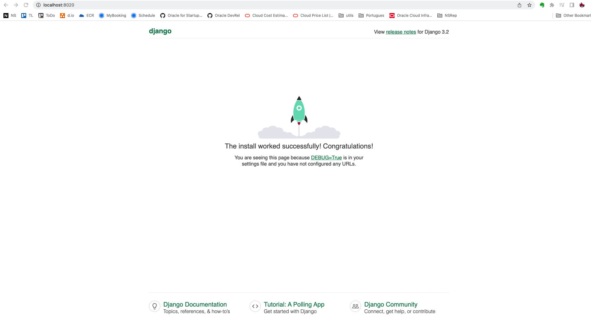

# django-k8-sample
This is a sample django project deployable to Oracle Kubernetes Engine


Commands ran: 

```shell
ubuntu@dalquintubuntuarm:~/REPOS/django-k8-sample$ source venv/bin/activate
ubuntu@dalquintubuntuarm:~/REPOS/django-k8-sample$ mkdir web
(venv) ubuntu@dalquintubuntuarm:~/REPOS/django-k8-sample$ cd web/
(venv) ubuntu@dalquintubuntuarm:~/REPOS/django-k8-sample/web$ django-admin startproject django_k8s_sample .

```
For testing the deployment: 

```shell
cd /home/ubuntu/REPOS/django-k8-sample/web
/home/ubuntu/REPOS/django-k8-sample/venv/bin/gunicorn django_k8s.wsgi:application
```

For Docker. 

1. Create file `.dockerignore`inside web directory and copy all the contents from `.gitignore`into it
2. Create the `Dockerfile`file in web directory and set the content
3. Create file `entrypoint.sh` with it's corresponding content

4. Write the `docker-compose.yaml`file
5. Run `docker-compose up` This will build the image
    Note: You can run `docker system prune -a` to wipe out all
    You can stop the container by running `docker-compose down`
    You can force the re-build of image by running `docker-compose up --build`
6. If everything goes fine, when opening `http://localhost:8020` will show something like this




